# Session 1

## What are we going to do today?

> 1. Greetings/Introduction Reel (`5 Minutes`)
> 1. Introduction of eShop Main GitHub Repository (`5 Minutes`)
> 1. PowerShell/Shell Scripts in 'Main' Repository (`5 Minutes`)
> 1. Deploy Infrastructure and Products Microservices from Main (`5 Minutes`)
> 1. Introduction to the eShop Client Application Saga (`40 Minutes`)
> 1. Review/Q & A/Panel Discussion (`5 Minutes`)
> 1. What is next in `Session 12`? (`5 Minutes`)

## 1. Greetings/Introduction Reel (`5 Minutes`)

> 1. Discussion and Demo

## 2. Introduction of eShop Main GitHub Repository (`5 Minutes`)

> 1. Discussion and Demo

### Parent Folder for all Microservices


### eShop Main Folder


## 3. PowerShell/Shell Scripts in 'Main' Repository (`5 Minutes`)

> 1. Discussion and Demo

### Executing Shell Script to Pull/Get the latest code from GitHub

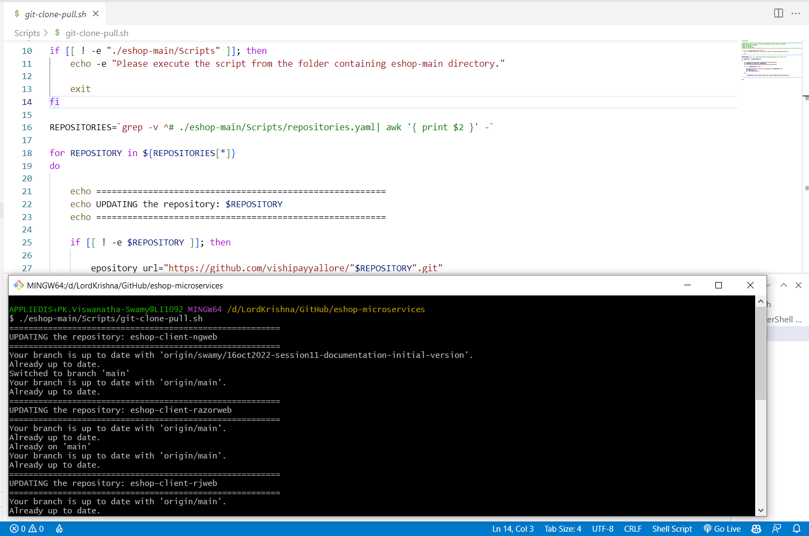

### Executing PowerShell Script to Pull/Get the latest code from GitHub

**Note:** Please make sure you have PowerShell 7+ installed on your machine.

```powershell
Install-Module PowerShell-yaml -Force
```


## 4. Deploy Infrastructure and Products Microservices from Main (`5 Minutes`)

> 1. Discussion and Demo

### Deploy Entire Solution


## 5. Introduction to the eShop Client Application Saga (`40 Minutes`)

> 1. Discussion and Demo

### Client application in Angular (`5 minutes`)

> 1. Discussion
> 1. Why Angular? Why not?

### How to start a project (`5 minutes`)

> 1. Demo and Discussion
> 2. Discuss why we are using @14.2
> 3. Start an new angular project

> 4. Installed versions - node, angular/cli
> 5. `ng new` to create a new project
> 6. Indicate that this is an npm project (modify package.json as desired)
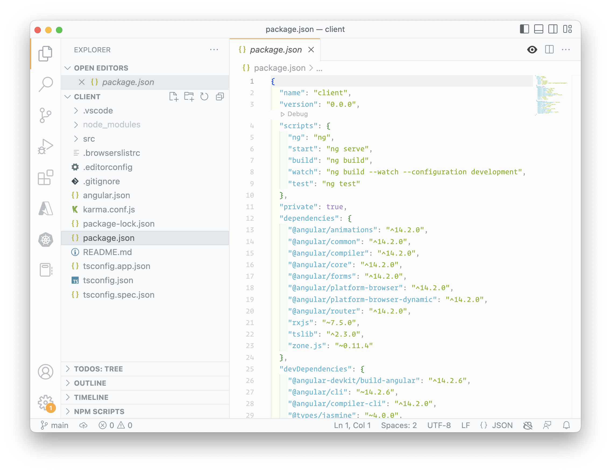

### Discuss Configuration (`5 minutes`)

> 1. Angular configuration variables

> 2. Expose `process.env` and _angular's environment_ inside the component

> 3. Render `process.env` and _angular's environment_ inside the template

> 4. Viewing `process.env` and angular's environment in Browser
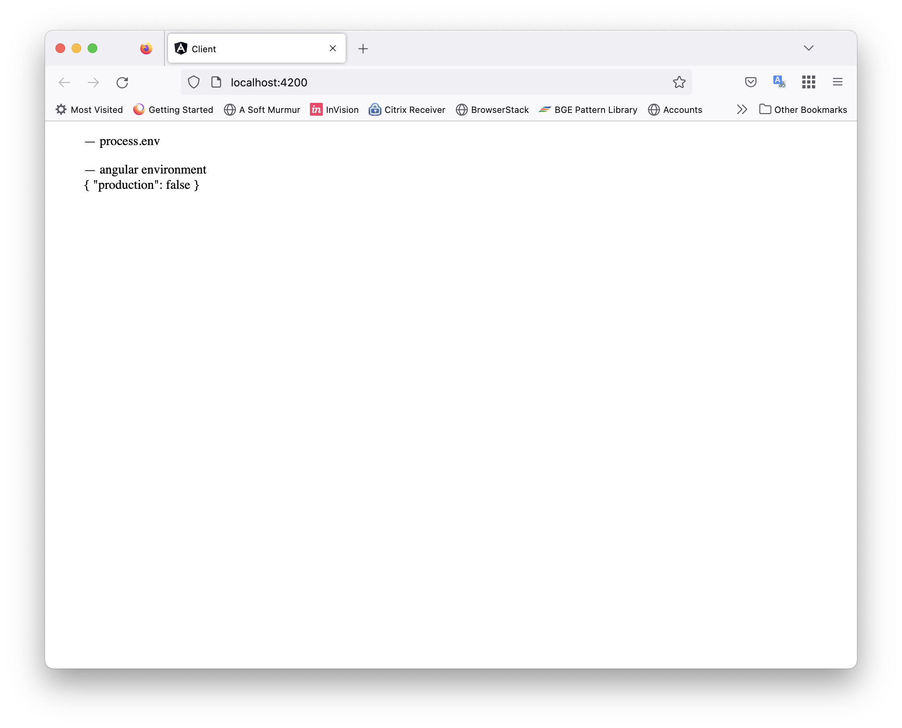

### Add Products component (`5 minutes`)

> 1. Setup products component

> 2. Setup products component template using `async pipe`
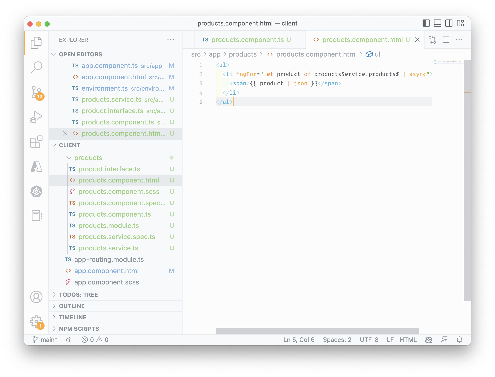
> 3. Provide products to render in component

> 4. Support `HttpClient` from app module

> 5. Create `product` Module
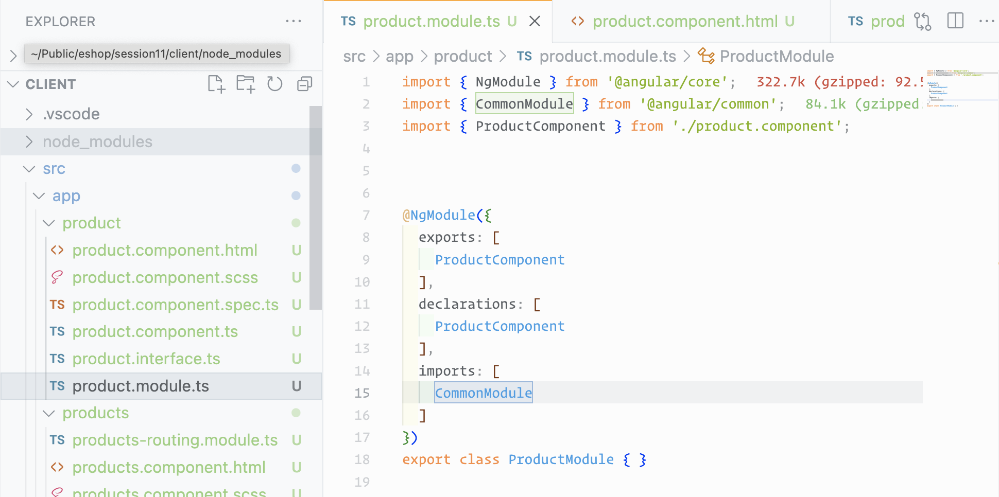

### Discuss `routing` (10 minutes)

> 1. Add `product` route
> 2. Add `default` route
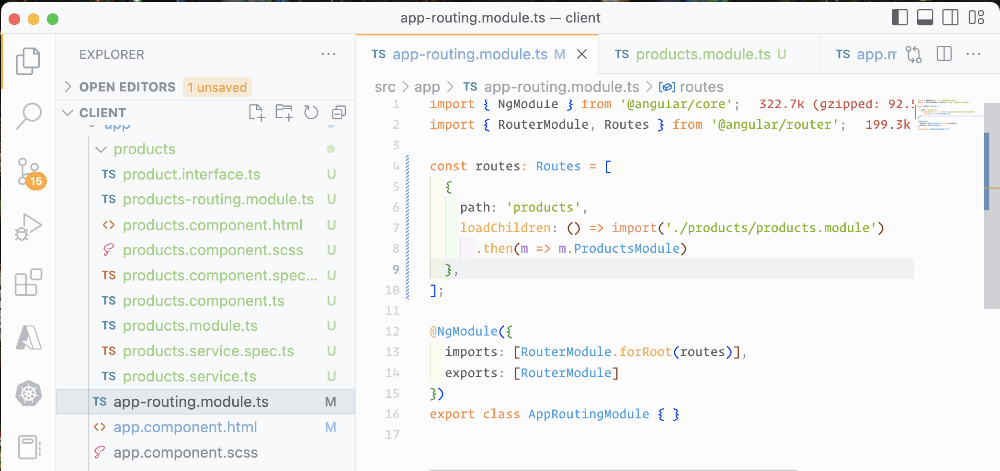
> 3. Add router outlet
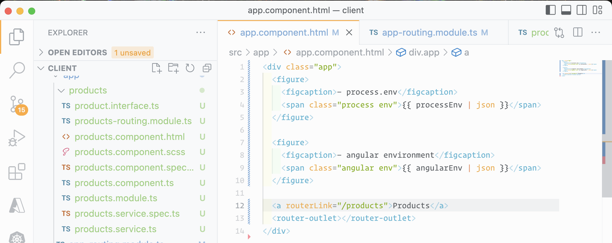
> 4. Setup lazy-loading of products module
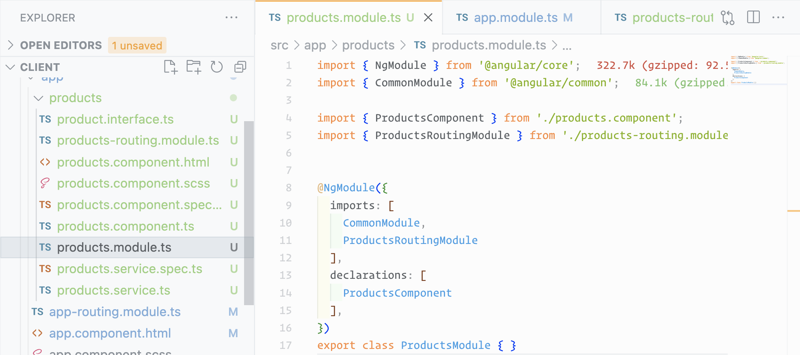

> 5. Demo `Client Application` in Browser
> 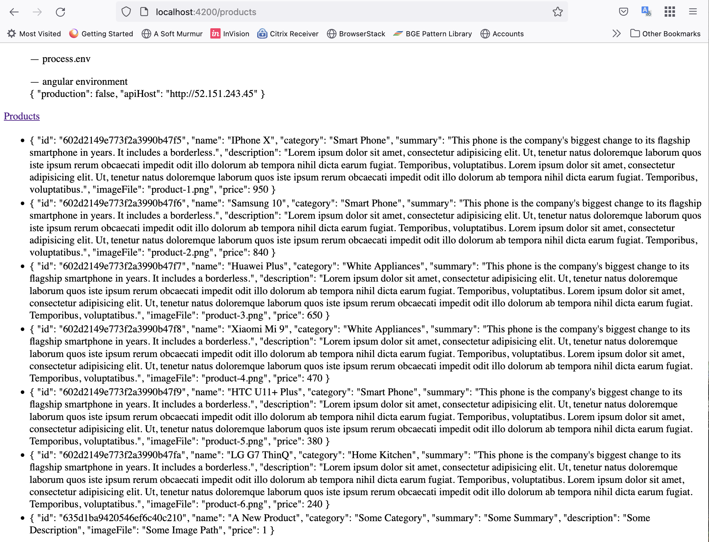

### Make `products` look more like `products` (10 minutes)

> 1. Add product component
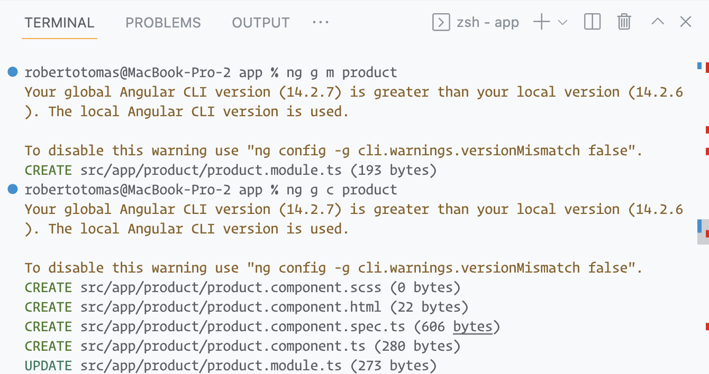
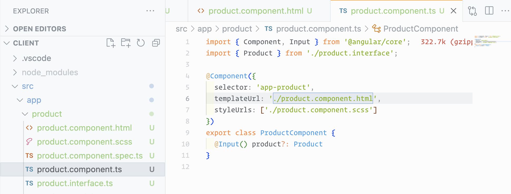

> 2. Add `product` styling
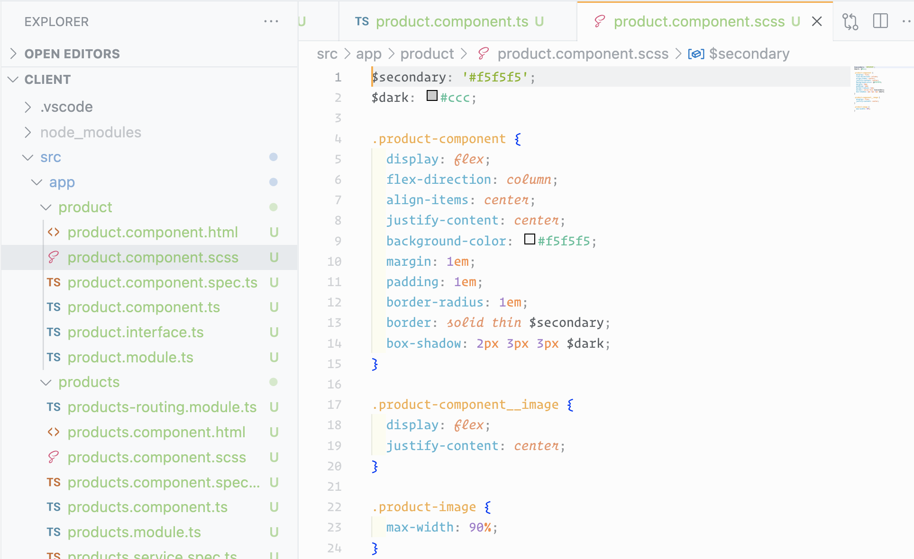
> 3. Add `product` component to `products` module
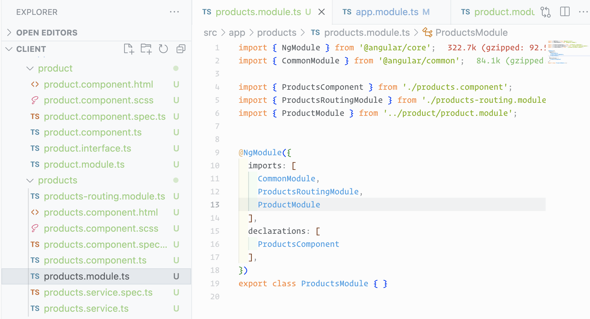

> 4. Demo `products` page in Browser


### Discuss production build process (5 minutes)

> 1. Discussion and Demo

## 6. Review/Q & A/Panel Discussion (`5 Minutes`)

> 1. Discussion

## 7. What is next in `Session 12`? (`5 Minutes`) on `18-Nov-2022`

> 1. Greetings/Introduction Reel (`5 Minutes`)
> 1. Deep Dive into Configuring the Angular Project for Development (`50 Minutes`)
> 1. Review/Q & A/Panel Discussion (`5 Minutes`)
> 1. What is next in `Session 12`? (`5 Minutes`)
