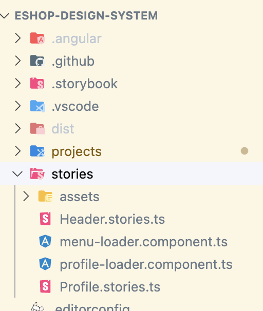
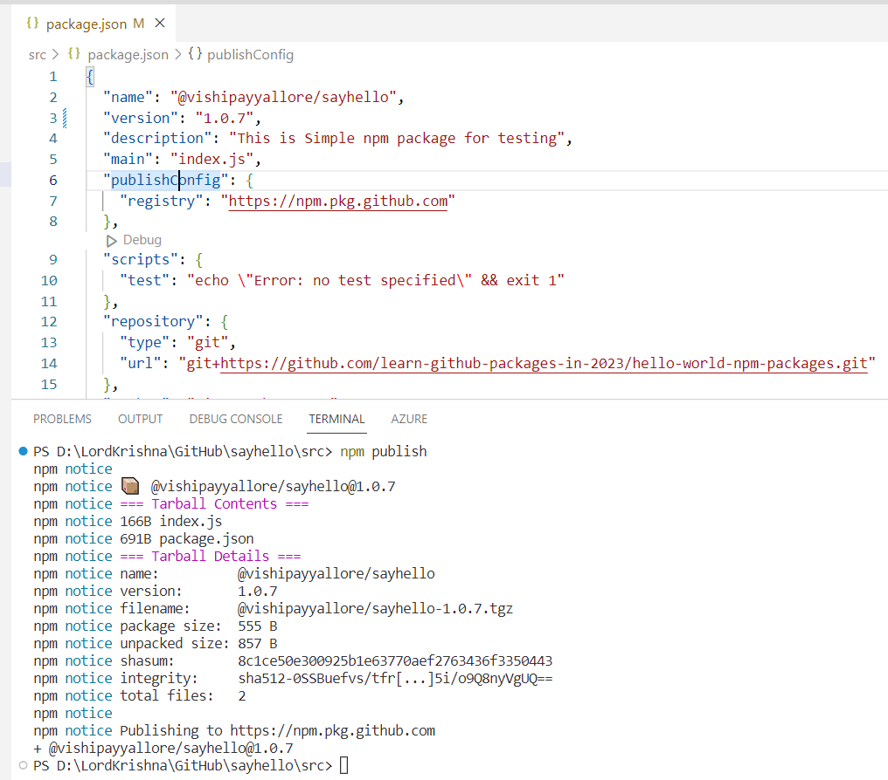
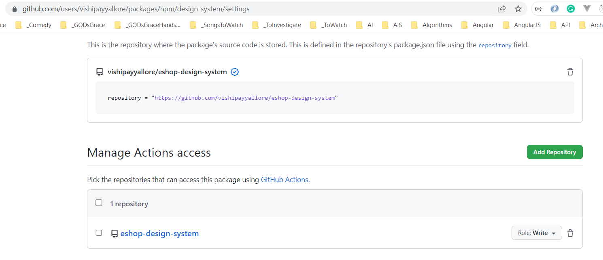
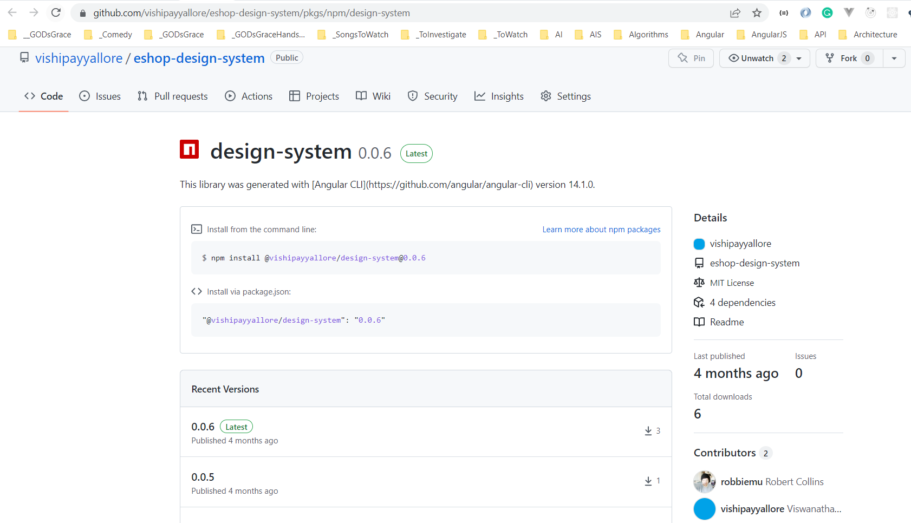
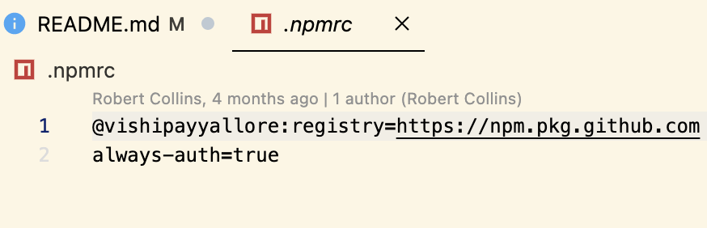

# Session 4

## What are we going to do today?

> 1. Greetings/Introduction Reel (`5 Minutes`)
> 1. Wrap up Design System (`20 minutes`)
>    - Introduce design system concept:  
>      - Compare/contrast with micro-frontend (`10 minutes`)
>      - Show styles, header, (profile foreshadowing?) (`10 minutes`)
> 1. Create the package in github (`15 minutes`)
>    - Intro to npm artifact, artifacts on github (`5 minutes`)
>    - Configure github action to create artifact (`5 minutes`)
>    - Demo artifact creation (`5 minutes`)
> 1. Consume package in client (`10 minutes`)
>    - Configure for the developer (5 minutes)
>      - Add .npmrc in repo
>      - Add ~/.npmrc
>    - Demo (5 minutes)
> 1. Review/Q & A/Panel Discussion (`5 Minutes`)
> 1. What is next in Session `15`? (`5 Minutes`)

## 1. Greetings/Introduction Reel (`5 Minutes`)

> 1. Discussion and Demo

## 2. Wrap up Design System (`20 minutes`)

> 1. Discussion and Demo

### 2.1. Introduce design system concept  

> 1. Discussion and Demo

#### Compare/contrast with micro-frontend (`10 minutes`)

> 1. Discussion and Demo

We will not be going into very much detail with the actual designs in our design system. This is because we built this largely starting from icons generated by AI that we used to give a sample look and feel.


The AI did not design a proper design system for us, rather it designed only an icon for us to use. From that we fleshed out fonts, colors, light and dark mode, etc.


It sufficies to show the pattern but it is not something that has been refined by a designer; none of us are really prepared to do that for this project. Perhaps we are being a little generic about what we are actually delivering, so I think it makes sense to add some more clarity, and opinions, about what we will be delivering is actually supposed to do to benefit the project. With that, let's compare this approach to independent components with another, namely: microfrontends.

##### design system pluses and minuses

- allows projects to mostly focus on local concerns

- facilitates code reuse and modular development

- requires adherance to update based on development in external projects
- hard to navigate between too abstract to be useful and too concrete to be independent

##### microfrontend pluses and minuses

- facilitates code reuse and modular development

- can remove adherence requirements for updates
- facilitates provisioning third party vendors

- increases code, technology and team complexity
- encourages lazy code duplication

##### when to chose what

- common styling: design system
- reusable components: design system
- enforcing control when working with "external" teams: MFE
- maximizing "internal" teams independent growth: MFE

##### References

- <https://codigoencasa.com/tu-primer-microfrontend-de-angular/>
- <https://blog.bitsrc.io/better-micro-frontends-and-design-systems-with-independent-components-c2e2187d73c9>

#### Show styles, header, (profile foreshadowing?) (`10 minutes`)

> 1. Discussion and Demo

Our design system has common assets and styles that we expose to dependent projects:


And we mount and validate the components using storybook:



Storybook also acts as a handy documentation base for the design system. It renders views like this:

##### Header


##### Profile


Having prepared a nice set of colors, fonts, other stlyes and components, we're ready to consume these components in external projects. For that, we'll need Swamy's help.

## 3. Create the package in github (`15 minutes`)

> 1. Discussion

**References:**

> 1. [https://docs.github.com/en/packages/working-with-a-github-packages-registry/working-with-the-npm-registry](https://docs.github.com/en/packages/working-with-a-github-packages-registry/working-with-the-npm-registry)

### Intro to npm artifact, artifacts on github (`5 minutes`)

> 1. Discussion


#### Sample package.json

```json
{
    name: "@vishipayyallore/sayhello",
    version: "1.0.6",
    description: "This is Simple npm package for testing",
    main: "index.js",
    publishConfig: {
        registry: "https://npm.pkg.github.com"
    }
}
```

#### Generate the GitHub Personal Access Token

**References:**

> 1. [https://docs.github.com/en/authentication/keeping-your-account-and-data-secure/creating-a-personal-access-token](https://docs.github.com/en/authentication/keeping-your-account-and-data-secure/creating-a-personal-access-token)


#### Update `~/.npmrc` file

```.npmrc
@vishipayyallore:registry=https://npm.pkg.github.com/
always-auth=true
//npm.pkg.github.com/:_authToken=Your-Personal-Access-Token
```

#### Publishing the package from local machine

```npm
npm publish
```



### Configure github action to create artifact (`5 minutes`)

> 1. Discussion

```yml
name: Publish hello-world NPM Package

on:
  push:
    branches: [ main ]
  release:
    types: [created]

  # Allows you to run this workflow manually from the Actions tab
  workflow_dispatch:

jobs:
  publish-gpr:
    runs-on: ubuntu-latest
    permissions:
      contents: read
      packages: write
    steps:
      - uses: actions/checkout@v3
      - uses: actions/setup-node@v3
        with:
          node-version: 16
          registry-url: https://npm.pkg.github.com/
      - run: npm install
        working-directory: ./src
      - run: npm publish 
        working-directory: ./src
        env:
          NODE_AUTH_TOKEN: ${{secrets.GITHUB_TOKEN}}
```

### Permission for `private packages`



### GitHub Actions Workflow


### Demo artifact creation (`5 minutes`)

> 1. Discussion



## 4. Consume package in client (`10 minutes`)

> 1. Discussion

Now, upon setting up our `~/.npmrc` with our token, as shown earlier, a developer can consume this in the content of this project.

### 4.1. Configure for the developer (5 minutes)

> 1. Discussion

#### Add .npmrc in repo

> 1. Discussion

First, we need to configure the project to import our design system from github's npm source:


#### install the package

That allows us to install it in the usual way:
> `npm i -S @vishipayyallore/design-system`


#### consume the assets and styles

To consume the assets and styles in our project, we add them to the `angular.json` configuration.


And now our pages and the design system components that rely on these styles and assets will render properly:

Adding components to module in the usual way:


Using them in the html template in the usual way:


### 4.2. Demo (5 minutes)

> 1. Discussion


## 5. Review/Q & A/Panel Discussion (`5 Minutes`)

> 1. Discussion

---

## 6. What is next in `Session 15`? (`5 Minutes`) on `03-Feb-2023`

> 1. Greetings/Introduction Reel (`5 Minutes`)
> 1. To Be Done (`50 Minutes`)
> 1. Review/Q & A/Panel Discussion (`5 Minutes`)
> 1. What is next in `Session 14`? (`5 Minutes`)
