# eShop Client Application

Angular 14.x UI for eShop Client application

## Status Badges

| PR, and CI Builds | Code QL |
| ---------------------------------------------------------------------------------------------------------------------------------------------------------------------------------------------------------------------------------- | ------------------------------------------------------------------------------------------------------------------------------------------------------------------------------------------------------------------------- |
| To be done | To be done |

## Pre-Requisites

> 1. Windows 10 / Ubuntu 20.04 / Mac OS 12.3 (build 21E230)
> 1. NPM
> 1. Angular CLI
> 1. VS Code (<https://code.visualstudio.com/>)
> 1. Docker Desktop (<https://docs.docker.com/docker-for-windows/install/>)
> 1. PowerShell 7+

---

## Links to individual session(s) Documentation and its Videos

> 1. Please refer [Session1.md](./Documentation/Sessions/Session1.md) and [Video](https://www.youtube.com/watch?v=wQ0Xf4pKZaQ) for more details.

---


## What are we going to do today?

> 1. Greetings/Introduction Reel (`5 Minutes`)
> 1. Introduction of eShop Main GitHub Repository (`5 Minutes`)
> 1. PowerShell/Shell Scripts in 'Main' Repository (`5 Minutes`)
> 1. Deploy Infrastructure and Products Microservices from Main (`5 Minutes`)
> 1. Introduction to the eShop Client Application Saga (`40 Minutes`)
> 1. Review/Q & A/Panel Discussion (`5 Minutes`)
> 1. What is next in `Session 12`? (`5 Minutes`)


## 1. Greetings/Introduction Reel (`5 Minutes`)

> 1. Discussion and Demo

## 2. Introduction of eShop Main GitHub Repository (`5 Minutes`)

> 1. Discussion and Demo

### Parent Folder for all Microservices

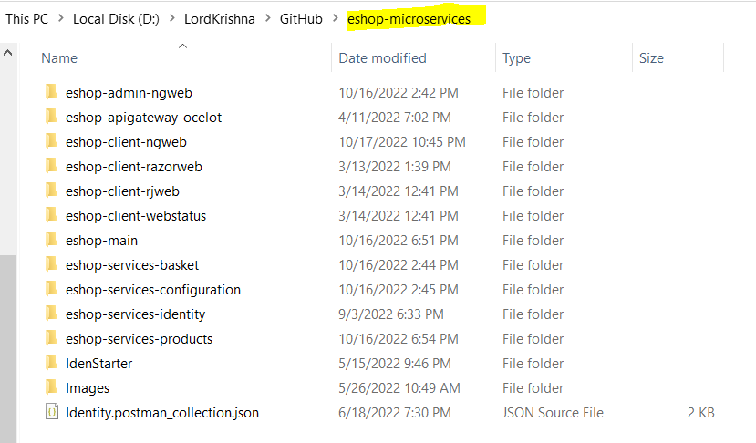

### eShop Main Folder

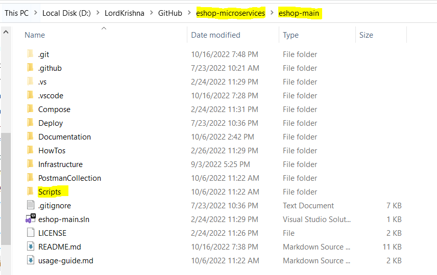

## 3. PowerShell/Shell Scripts in 'Main' Repository (`5 Minutes`)

> 1. Discussion and Demo

### Executing Shell Script to Pull/Get the latest code from GitHub

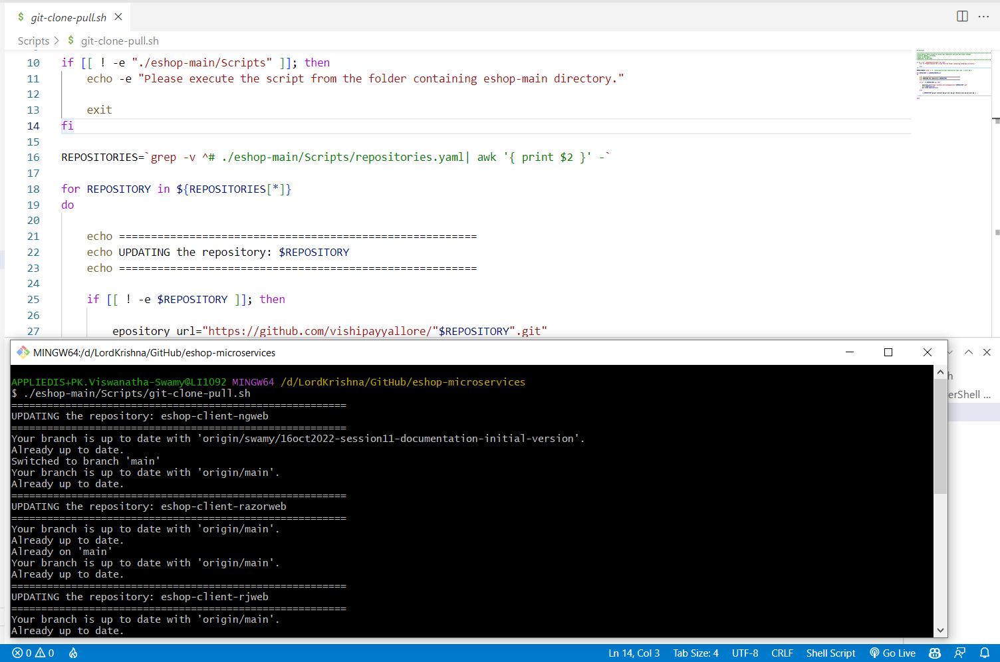

### Executing PowerShell Script to Pull/Get the latest code from GitHub

**Note:** Please make sure you have PowerShell 7+ installed on your machine.

```powershell
Install-Module PowerShell-yaml -Force
```

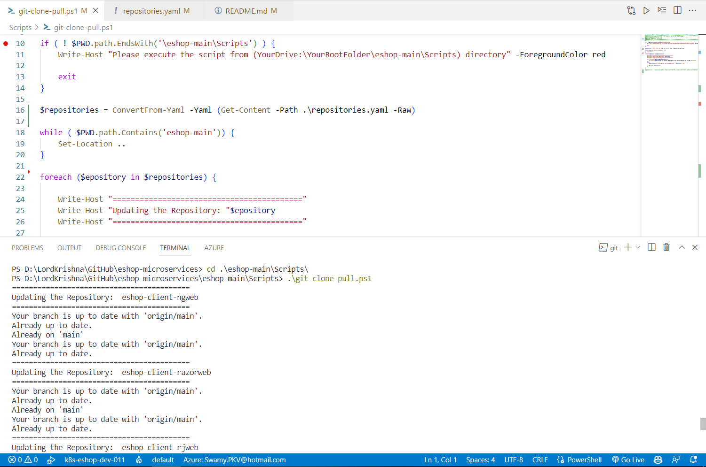

## 4. Deploy Infrastructure and Products Microservices from Main (`5 Minutes`)

> 1. Discussion and Demo

### Deploy Entire Solution

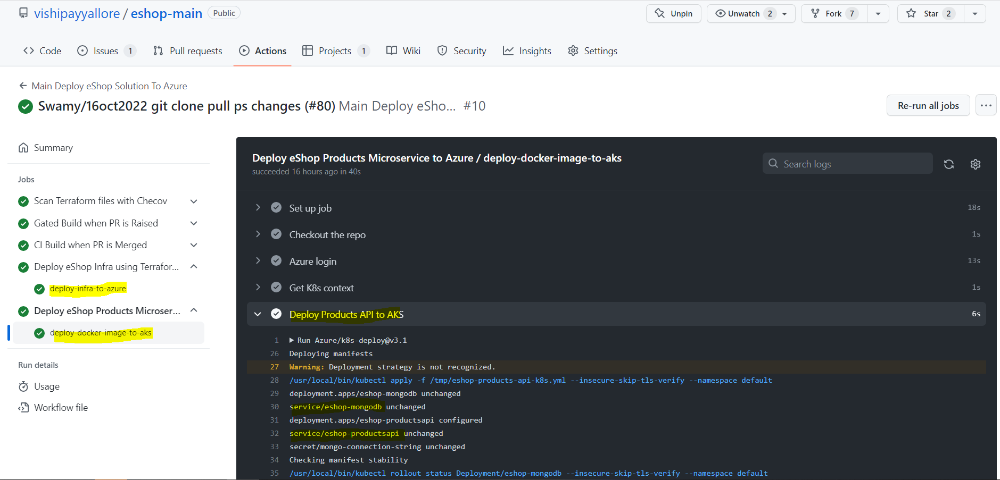

## 5. Introduction to the eShop Client Application Saga (`40 Minutes`)

> 1. Discussion and Demo

### Client application in Angular (`5 minutes`)

> 1. Discussion
> 1. why angular? why not?

### How to start a project (`5 minutes`)

> 1. Demo and Discussion
> 2. Discuss why we are using @14.2
> 3. Start an new angular project
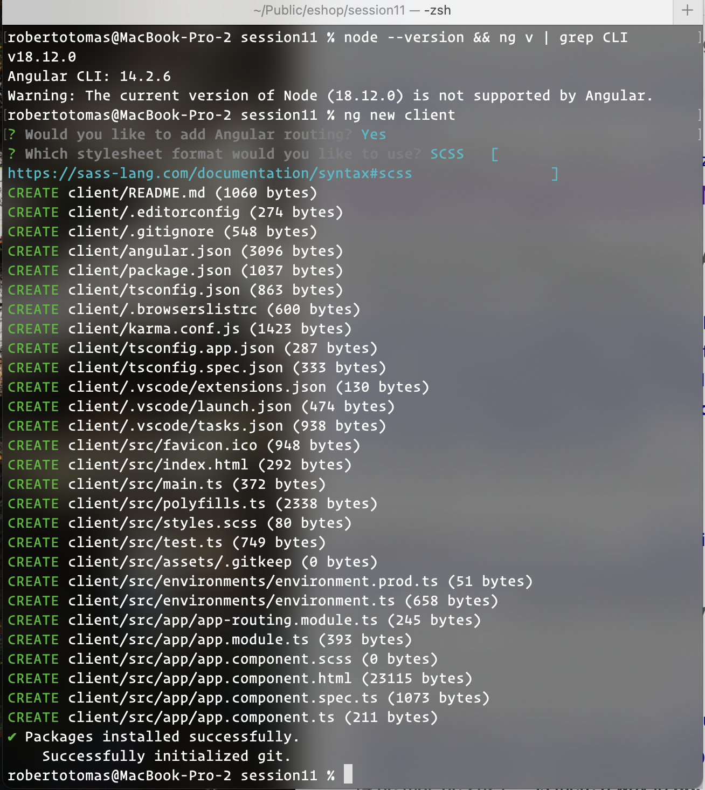
> 4. Installed versions - node, angular/cli
> 5. `ng new` to create a new project
> 6. Indicate that this is an npm project (modify package.json as desired)


### How to add Configuration (`5 minutes`)

> 1. Discuss using configuration variables
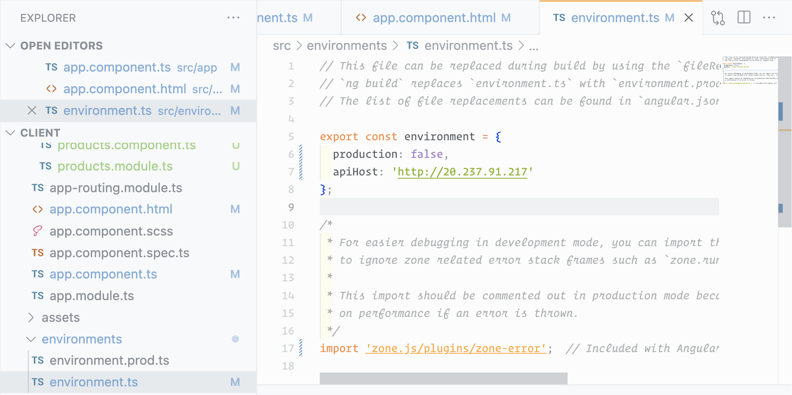
> 2. Indicate `apiHost` for products
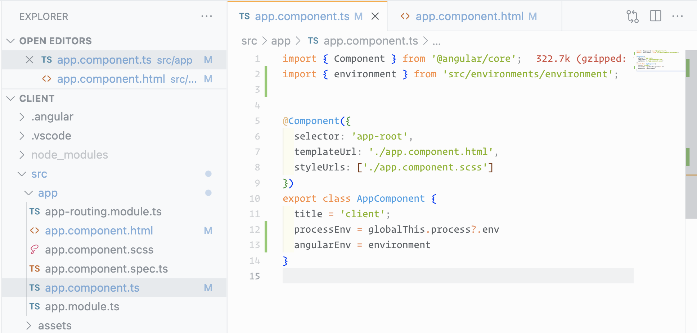
> 3. Expose `process.env` and `angular's environment` inside the component
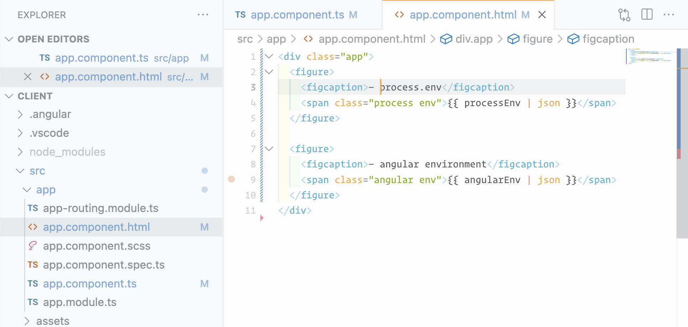
> 4. Render `process.env` and `angular's environment` inside Browser
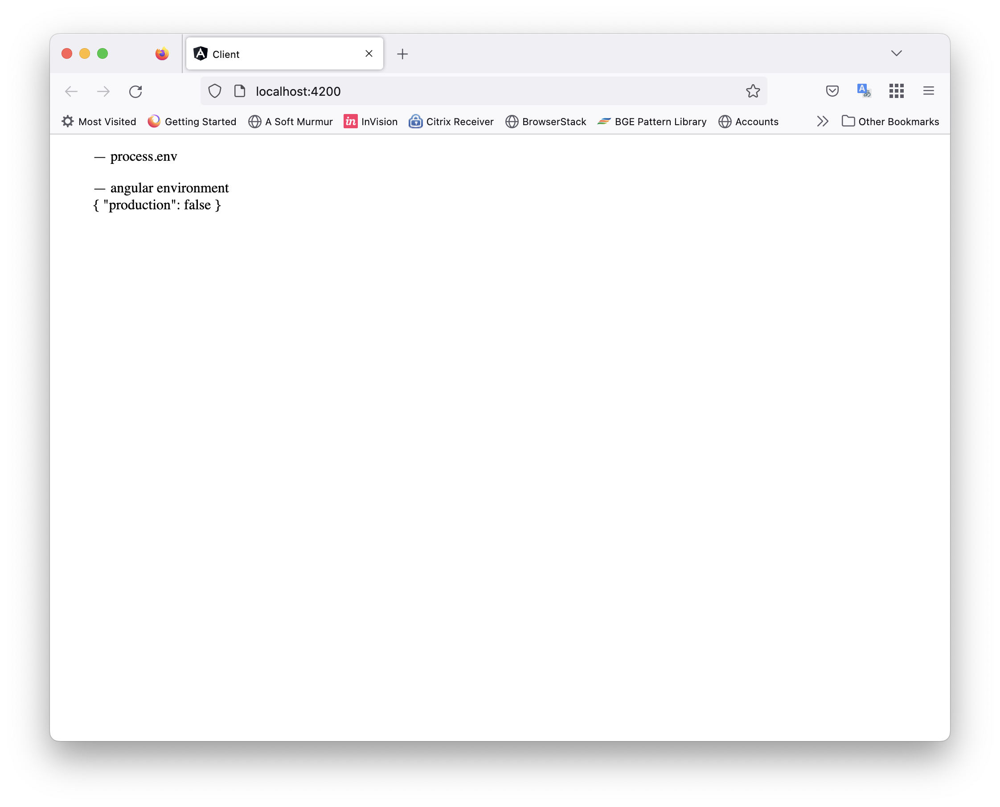

### Add Products component (`5 minutes`)

> 1. set up products component

> set up a component to render products (which we will get from a service, following MVC)

> use async pipe to render products as they become available

> handle transaction logic in a service
>
> 1. demo client

### Discuss routing (10 minutes)

> 1. add product route
> 1. add default route
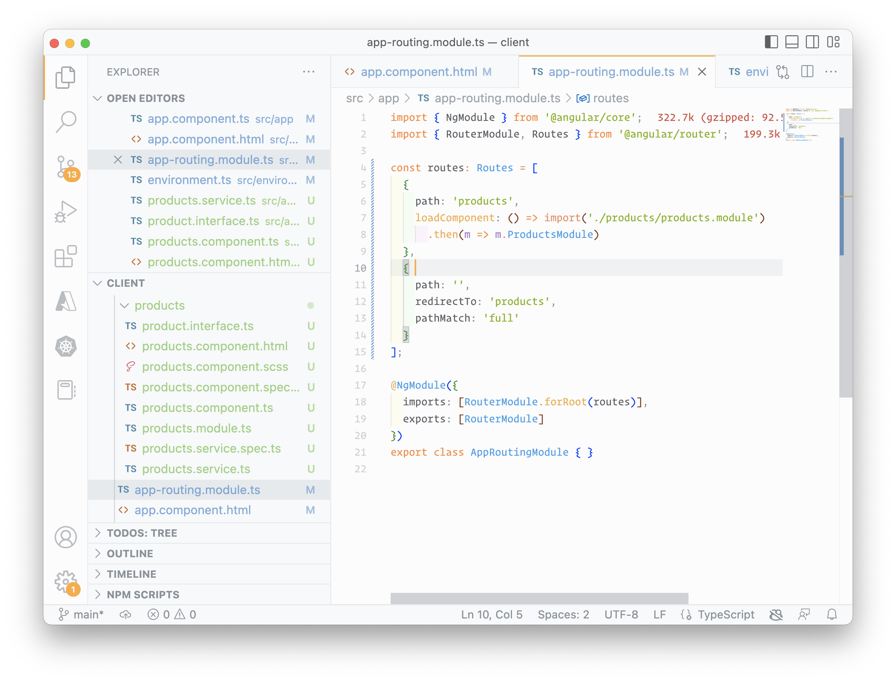

### Demo client -showing from default route (10 minutes)

> 1. add products styling

### Discuss production build process (5 minutes)

> 1. Discussion and Demo

## 6. Review/Q & A/Panel Discussion (`5 Minutes`)

> 1. Discussion

## 7. What is next in `Session 12`? (`5 Minutes`) on `18-Nov-2022`

> 1. Greetings/Introduction Reel (`5 Minutes`)
> 1. To be done (`5 Minutes`)
> 1. Review/Q & A/Panel Discussion (`5 Minutes`)
> 1. What is next in `Session 12`? (`5 Minutes`)

---

## `***** WISH LIST - Future Sessions to be planned *****`

> 1. Dockerize the Client Application
> 1. Deploy the Client Application to Azure Kubernetes Service
> 1. GitHUB Actions for CI/CD
