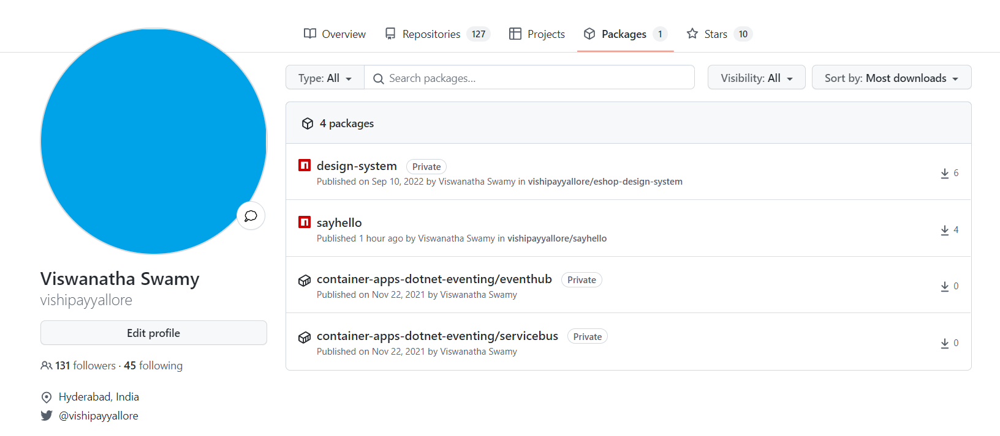
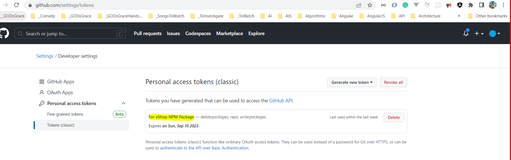
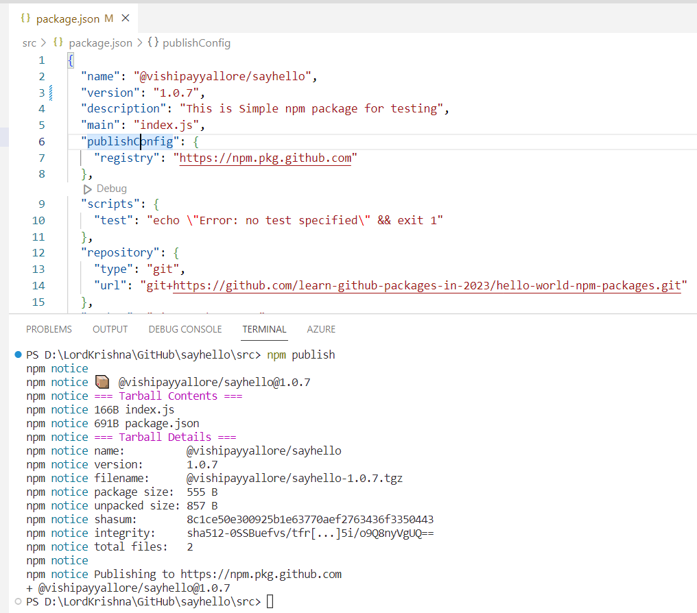
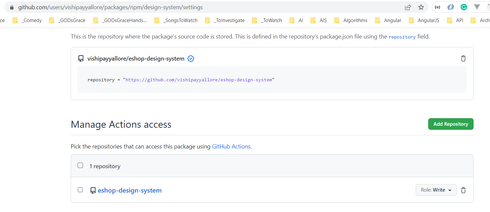
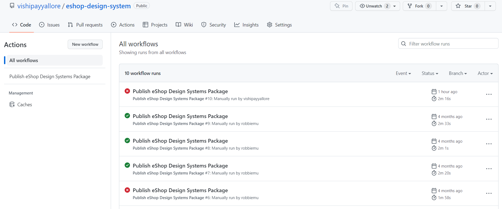
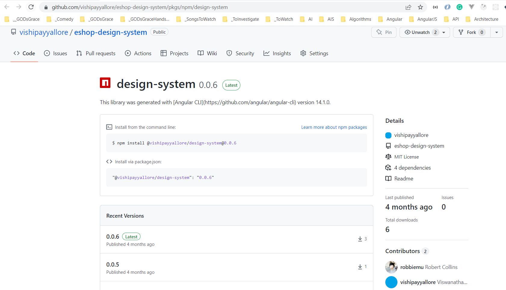

# eShop Client Application

Angular 14.x UI for eShop Client application

## Status Badges

| PR, and CI Builds | Code QL |
| ---------------------------------------------------------------------------------------------------------------------------------------------------------------------------------------------------------------------------------- | ------------------------------------------------------------------------------------------------------------------------------------------------------------------------------------------------------------------------- |
| To be done | To be done |

## Pre-Requisites

> 1. Windows 10 / Ubuntu 20.04 / Mac OS 12.3 (build 21E230)
> 1. NPM
> 1. Angular CLI
> 1. VS Code (<https://code.visualstudio.com/>)
> 1. Docker Desktop (<https://docs.docker.com/docker-for-windows/install/>)
> 1. PowerShell 7+

---

## Links to individual session(s) Documentation and its Videos

**Note:**: The links below are to the individual session(s) documentation and its videos.

> 1. Please refer [**eshop-main**](https://github.com/vishipayyallore/eshop-main/blob/main/README.md) for the links to individual session(s) documentation and its videos for the entire series.
> 1. Please refer [Session**1**.md](./Documentation/Sessions/Session1.md) and [Video](https://www.youtube.com/watch?v=ckWZIZVDBjI) for more details.
> 1. Please refer [Session**2**.md](./Documentation/Sessions/Session2.md) and [Video](https://www.youtube.com/watch?v=-F9xI4Xu_p8) for more details.
> 1. Please refer [Session**3**.md](./Documentation/Sessions/Session3.md) and [Video](https://www.youtube.com/watch?v=XKScxbJQo04) for more details.
> 1. Please refer [Session**4**.md](./Documentation/Sessions/Session4.md) and [Video](https://www.youtube.com/watch?v=il6wq6zHfMk) for more details.

---


## What are we going to do today?

> 1. Greetings/Introduction Reel (`5 Minutes`)
> 1. Wrap up Design System (`20 minutes`)
>    - Introduce design system concept:  
>      - Compare/contrast with micro-frontend (`10 minutes`)
>      - Show styles, header, (profile foreshadowing?) (`10 minutes`)
> 1. Create the package in github (`15 minutes`)
>    - Intro to npm artifact, artifacts on github (`5 minutes`)
>    - Configure github action to create artifact (`5 minutes`)
>    - Demo artifact creation (`5 minutes`)
> 1. Consume package in client (`10 minutes`)
>    - Configure for the developer (5 minutes)
>      - Add .npmrc in repo
>      - Add ~/.npmrc
>    - Demo (5 minutes)
> 1. Review/Q & A/Panel Discussion (`5 Minutes`)
> 1. What is next in Session `14`? (`5 Minutes`)


## 1. Greetings/Introduction Reel (`5 Minutes`)

> 1. Discussion

## 2. Wrap up Design System (`20 minutes`)

> 1. Discussion and Demo

### 2.1. Introduce design system concept  

> 1. Discussion and Demo

#### Compare/contrast with micro-frontend (`10 minutes`)

> 1. Discussion and Demo

#### Show styles, header, (profile foreshadowing?) (`10 minutes`)

> 1. Discussion and Demo

## 3. Create the package in github (`15 minutes`)

> 1. Discussion

**References:**

> 1. [https://docs.github.com/en/packages/working-with-a-github-packages-registry/working-with-the-npm-registry](https://docs.github.com/en/packages/working-with-a-github-packages-registry/working-with-the-npm-registry)

### Intro to npm artifact, artifacts on github (`5 minutes`)

> 1. Discussion



#### Sample package.json

```json
{
    name: "@vishipayyallore/sayhello",
    version: "1.0.6",
    description: "This is Simple npm package for testing",
    main: "index.js",
    publishConfig: {
        registry: "https://npm.pkg.github.com"
    }
}
```

#### Generate the GitHub Personal Access Token

**References:**

> 1. [https://docs.github.com/en/authentication/keeping-your-account-and-data-secure/creating-a-personal-access-token](https://docs.github.com/en/authentication/keeping-your-account-and-data-secure/creating-a-personal-access-token)



#### Update `~/.npmrc` file

```.npmrc
@vishipayyallore:registry=https://npm.pkg.github.com/
always-auth=true
//npm.pkg.github.com/:_authToken=Your-Personal-Access-Token
```

#### Publishing the package from local machine

```npm
npm publish
```



### Configure github action to create artifact (`5 minutes`)

> 1. Discussion

```yml
name: Publish hello-world NPM Package

on:
  push:
    branches: [ main ]
  release:
    types: [created]

  # Allows you to run this workflow manually from the Actions tab
  workflow_dispatch:

jobs:
  publish-gpr:
    runs-on: ubuntu-latest
    permissions:
      contents: read
      packages: write
    steps:
      - uses: actions/checkout@v3
      - uses: actions/setup-node@v3
        with:
          node-version: 16
          registry-url: https://npm.pkg.github.com/
      - run: npm install
        working-directory: ./src
      - run: npm publish 
        working-directory: ./src
        env:
          NODE_AUTH_TOKEN: ${{secrets.GITHUB_TOKEN}}
```

### Permission for `private packages`



### GitHub Actions Workflow



### Demo artifact creation (`5 minutes`)

> 1. Discussion



## 4. Consume package in client (`10 minutes`)

> 1. Discussion

### 4.1. Configure for the developer (5 minutes)

> 1. Discussion

#### Add .npmrc in repo

> 1. Discussion

#### Add ~/.npmrc

> 1. Discussion

### 4.2. Demo (5 minutes)

> 1. Discussion

## 5. Review/Q & A/Panel Discussion (`5 Minutes`)

> 1. Discussion

## 6. What is next in Session `15`? (`5 Minutes`) on `03-Feb-2023`

> 1. Greetings/Introduction Reel (`5 Minutes`)
> 1. Introduction to Design System (`50 Minutes`)
> 1. Review/Q & A/Panel Discussion (`5 Minutes`)
> 1. What is next in Session `15`? (`5 Minutes`)

---

## `***** WISH LIST - Future Sessions to be planned *****`

> 1. Dockerize the Client Application
> 1. Deploy the Client Application to Azure Kubernetes Service
> 1. GitHUB Actions for CI/CD
