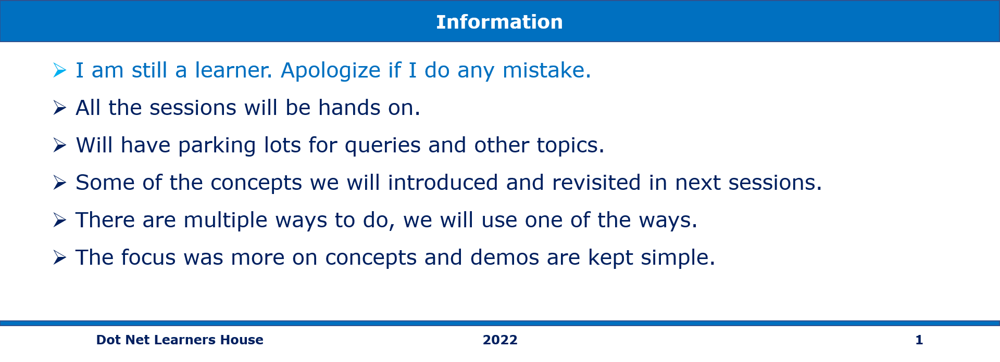

# eShop Client Application

Angular 14.x UI for eShop Client application

## Status Badges

| PR, and CI Builds | Code QL |
| ---------------------------------------------------------------------------------------------------------------------------------------------------------------------------------------------------------------------------------- | ------------------------------------------------------------------------------------------------------------------------------------------------------------------------------------------------------------------------- |
| To be done | To be done |

## Pre-Requisites

> 1. Windows 10 / Ubuntu 20.04 / Mac OS 12.3 (build 21E230)
> 1. NPM
> 1. Angular CLI
> 1. VS Code (<https://code.visualstudio.com/>)
> 1. Docker Desktop (<https://docs.docker.com/docker-for-windows/install/>)
> 1. PowerShell 7+

---

## Links to individual session(s) Documentation and its Videos

**Note:**: The links below are to the individual session(s) documentation and its videos.

> 1. Please refer [**eshop-main**](https://github.com/vishipayyallore/eshop-main/blob/main/README.md) for the links to individual session(s) documentation and its videos for the entire series.
> 1. Please refer [Session**1**.md](./Documentation/Sessions/Session1.md) and [Video](https://www.youtube.com/watch?v=ckWZIZVDBjI) for more details.
> 1. Please refer [Session**2**.md](./Documentation/Sessions/Session2.md) and [Video](https://www.youtube.com/watch?v=-F9xI4Xu_p8) for more details.
> 1. Please refer [Session**3**.md](./Documentation/Sessions/Session3.md) and [Video](https://www.youtube.com/watch?v=XKScxbJQo04) for more details.
> 1. Please refer [Session**4**.md](./Documentation/Sessions/Session4.md) and [Video](https://www.youtube.com/watch?v=il6wq6zHfMk) for more details.

---

## What are we going to do today?

> 1. Greetings/Introduction Reel (`5 Minutes`)
> 1. Wrap up client configurations (`25 minutes`)
>    - Jest (`15 minutes`)
>    - Husky (`10 minutes`)
> 1. Separate design concerns (`20 minutes`)
>    - Just show how to set up a project library (`10 minutes`)
>    - Introduction to build process (`10 minutes`)
>       - Overview of build process considerations: ivy, jit/aot (`5 minutes`)
>       - Package exports (`3 minutes`)
>       - Dist folder (`2 minutes`)
> 1. Introduce `Design System` (`5 minutes`)
> 1. Review/Q & A/Panel Discussion (`5 Minutes`)
> 1. What is next in Session `14`? (`5 Minutes`)

## 1. Greetings/Introduction Reel (`5 Minutes`)

> 1. Discussion

## 5. Review/Q & A/Panel Discussion (`5 Minutes`)

> 1. Discussion

## 6. What is next in Session `15`? (`5 Minutes`) on `03-Feb-2023`

> 1. Greetings/Introduction Reel (`5 Minutes`)
> 1. Introduction to Design System (`50 Minutes`)
> 1. Review/Q & A/Panel Discussion (`5 Minutes`)
> 1. What is next in Session `15`? (`5 Minutes`)

---

## `***** WISH LIST - Future Sessions to be planned *****`

> 1. Dockerize the Client Application
> 1. Deploy the Client Application to Azure Kubernetes Service
> 1. GitHUB Actions for CI/CD
